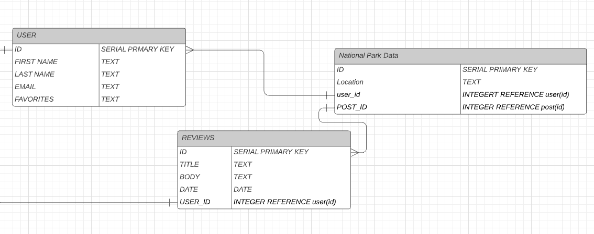

# Proposal

Requirements for the weekend

`1` An application name / concept 

National Park Reviews

`2` A repo for your project 2 (built from express_auth template)

`3` Wireframe for your app - (Lucidchart)

`4` An ERD with two models (minimum) > User + 1 Resource (one to many) - (Lucidchart)

ERD.png 

`5` Create (3-5) User Stories for the base user experience - ( [Reference](https://revelry.co/resources/development/user-stories-that-dont-suck/) )

when user log in, i want them to log-in so they can see campground information and leave reviews/update/post, so they can have an app that gives them valuable information
when the user is logged in, i want them to be able to search campgrounds and leave a review so they can see which campground works best for them and their needs based off of reviews.
when user has a review to leave, i want them to be able to leave one, so it helps others and they can remember to go back to this campground or not in the future.

I want the user to want to be happy when they login so they can review website information and leave comments and reviews.  these reviews will help others who are on the site and give feedback to campgrounds on what they can improve.

`6` Resource's Restful Routing table ( [Readme](https://romebell.gitbook.io/sei-412/node-express/00readme-1/01intro-to-express/00readme#restful-routing) )

`7` Find API and test to see if you can get data ( *be able to print data in the console using Axios, Node-Fetch, and/or Postman* )